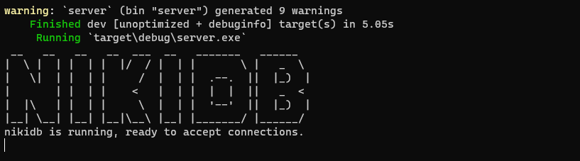
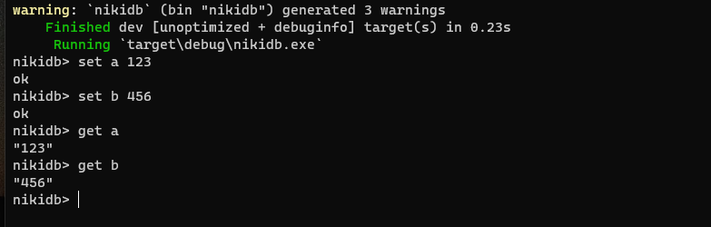

# nikidb
An embedded B+ tree-based persistent kv storage written in rust, similar to boltdb

example
```rust
use nikidb::db::DB;
use nikidb::db::DEFAULT_OPTIONS;
use nikidb::error::{NKError, NKResult};
use nikidb::tx::Tx;
use std::str;

fn main() {
    let db = DB::open("./test.db", DEFAULT_OPTIONS).unwrap();

    //create bucket
    db.update(Box::new(|tx: &mut Tx| -> NKResult<()> {
        match tx.create_bucket("default".as_bytes()) {
            Ok(_) => println!("create default bucket success"),
            Err(NKError::ErrBucketExists(e)) => println!("{} bucket exist", e),
            Err(e) => panic!("create bucket error"),
        }
        Ok(())
    }))
    .unwrap();

    //set key value
    db.update(Box::new(|tx: &mut Tx| -> NKResult<()> {
        let b = tx.bucket("default".as_bytes())?;
        b.put(b"abc", b"123").unwrap();
        Ok(())
    }))
    .unwrap();

    //get key value
    db.view(Box::new(|tx: &mut Tx| -> NKResult<()> {
        let b = tx.bucket("default".as_bytes())?;
        let v = b.get(b"abc").unwrap();
        println!("value:{:?}", str::from_utf8(v).unwrap());
        Ok(())
    }))
    .unwrap();
}
```


